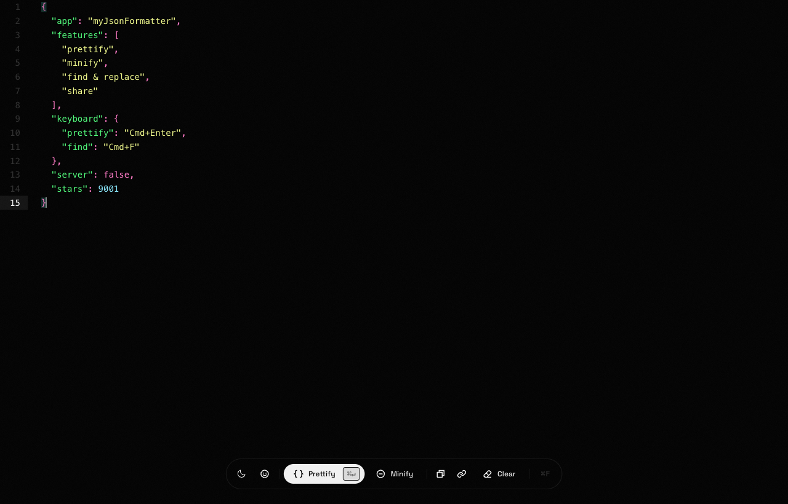

<div align="center">

# myJsonFormatter

**Um formatador de JSON minimalista e em tela cheia — prettify, minify, buscar/substituir e compartilhar, direto no navegador. Sem servidor, sem cadastro, sem poluição.**

<!-- LANG-SELECTOR:START -->
[English](README.md) · **Português (BR)**
<!-- LANG-SELECTOR:END -->

[](https://geldopc.github.io/myJsonFormatter/)
[](https://react.dev)
[](https://www.typescriptlang.org)
[](https://vite.dev)
[](https://tailwindcss.com)
[](#licença)

### [→ Abrir o app](https://geldopc.github.io/myJsonFormatter/)



</div>

---

## Por quê

A maioria das ferramentas de JSON online vive soterrada em anúncios, manda os seus dados para um servidor, ou esconde tudo atrás de uma parede de opções. O **myJsonFormatter** é o oposto: um editor em tela cheia, só as poucas ações que você realmente usa, e tudo acontece localmente no seu navegador. Cole, formate, compartilhe o link — pronto.

## Recursos

- ⚡ **Prettify e minify** com um clique ou um atalho — com saneamento automático de erros comuns (vírgulas sobrando, strings com JSON dentro de JSON) e um toast dizendo o que foi corrigido.
- 🎨 **Realce de sintaxe ao vivo** com CodeMirror 6, e **tema claro/escuro** (escuro por padrão).
- 🔍 **Buscar e Substituir** com **diferenciar maiúsculas**, **palavra inteira** e **regex** — todos os matches realçados, com um contador `atual/total` ao vivo.
- 🔗 **Compartilhar por URL** — o JSON é codificado no próprio link, então não há servidor e nada fica armazenado.
- 📋 **Copiar** para a área de transferência e 📂 **arrastar e soltar** um arquivo `.json` para carregá-lo na hora.
- ⌨️ **Foco no teclado** — formatar, buscar, selecionar tudo e desfazer sem tirar as mãos do teclado.
- 🙂 **Pausa pra rir** — uma tirinha aleatória de desenvolvedor do [developerslife.tech](https://developerslife.tech/en/) quando bater a vontade.
- 🪶 **100% no cliente** — sem backend, sem rastrear o seu JSON; publicado de graça no GitHub Pages.

## Atalhos de teclado

| Ação | Atalho |
| --- | --- |
| Prettify | `Ctrl`/`⌘` + `Enter` |
| Buscar e Substituir | `Ctrl`/`⌘` + `F` |
| Selecionar tudo | `Ctrl`/`⌘` + `A` |
| Desfazer / Refazer | `Ctrl`/`⌘` + `Z` / `Ctrl`/`⌘` + `Shift` + `Z` |
| Próximo / anterior (na busca) | `Enter` / `Shift` + `Enter` |
| Fechar painel | `Esc` |

## Tecnologias

- **[React 19](https://react.dev)** + **[TypeScript](https://www.typescriptlang.org)**
- **[Vite 6](https://vite.dev)** para o build
- **[Tailwind CSS v4](https://tailwindcss.com)** para o design minimalista preto-e-branco
- **[CodeMirror 6](https://codemirror.net)** (`@uiw/react-codemirror`) para o editor e o motor de buscar/substituir
- **[Radix UI](https://www.radix-ui.com)** + **[Phosphor Icons](https://phosphoricons.com)**, toasts com **[Sonner](https://sonner.emilkowal.ski)**, micro-animações com **[Lottie](https://airbnb.io/lottie)**
- **[Biome](https://biomejs.dev)** para lint e formatação

## Como rodar

```bash
git clone https://github.com/geldopc/myJsonFormatter.git
cd myJsonFormatter
npm install
npm run dev
```

O servidor de desenvolvimento sobe em `http://localhost:5300/myJsonFormatter/`.

### Build e preview

```bash
npm run build     # type-check + build de produção para dist/
npm run preview   # serve o build de produção localmente
```

### Lint e formatação

```bash
npm run check     # Biome lint + format (aplica as correções)
```

## Deploy

Todo push para a `main` dispara um workflow do **GitHub Actions** que faz o build e publica o app no **GitHub Pages** — veja [`.github/workflows/deploy.yml`](.github/workflows/deploy.yml). O app é totalmente estático, então não precisa de servidor.

## Créditos

- Tirinhas de desenvolvedor por **[developerslife.tech](https://developerslife.tech/en/)** — as tirinhas pertencem aos seus respectivos autores.
- Fontes: **Oxanium** e **Space Grotesk** via Fontsource.

## Licença

Distribuído sob a **Licença MIT**.

## Autor

Feito por **Geldo Pina Costa** — [@geldopc](https://github.com/geldopc).
